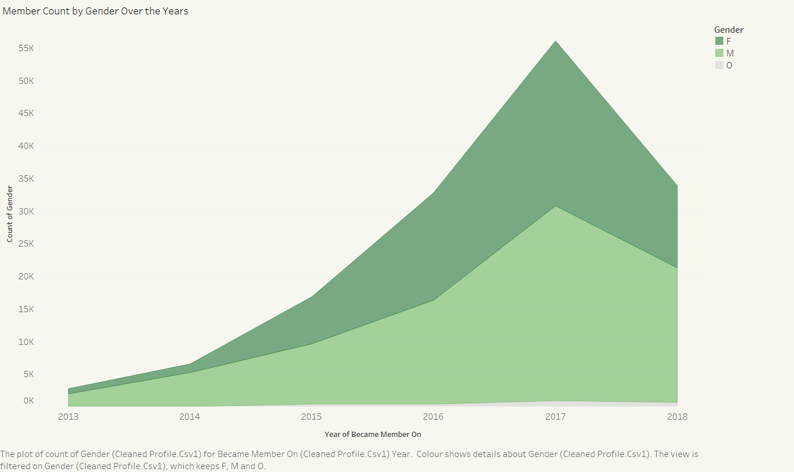

# Starbucks Customer Data EDA
## Project Overview
This project aims to visualise customer data in relation to promotions using Tableau. By analysing the relationship between customer behaviours and promotional activities, the company can gain insights to implement more targeted and effective marketing strategies.

## Project Structure
- **Data**: Cleaned data is stored in the `data/` and raw data is in the `data/raw` folder.
- **Notebooks**: The notebook for data cleaning is located in the `notebooks/` folder.
- **Scripts**: All Python scripts for data cleaning in the `scripts/` folder.
- **Results**: Visualisations can be found in the `results/figures` folder.

## Methodology
- **Data Preprocessing**: Cleaned the dataset by handling missing values and splitting dictionary keys and values for easier visualisation in Tableau.
- **Exploratory Data Analysis**: Performed visual analysis on customer demographics and promotions to understand customer behaviours and promotional activities.

## Key Findings
- 
- 
## Results

## Used Dataset
- **URL** : https://www.kaggle.com/datasets/ihormuliar/starbucks-customer-data
